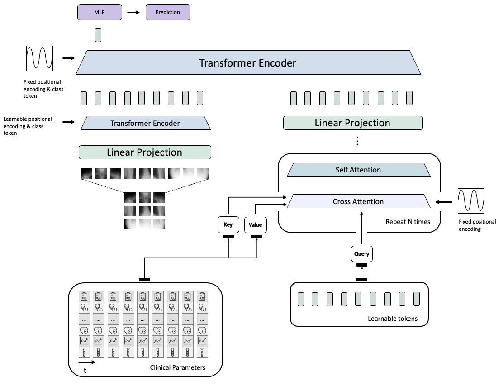

Medical Diagnosis with Large Scale Multimodal Transfomer
=========================

This repository contains the code to our corresponding publication "Medical Diagnosis with Large Scale Multimodal Transformers - Leveraging Diverse Data for More Accurate Diagnosis". In detail, it includes the model that we used to run the training of the neural networks on the MIMIC dataset and logs the results (such as the area under curve) on [weights and biases](https://wandb.ai)



# System Requirements
This code has been tested on Ubuntu 20.04 and an NVIDIA Quadro RTX 6000 GPU. Furthermore it was developed using Python v3.8.

# Setup

In order to run this model, please download MIMIC-CXR-JPG and MIMIC-IV (version 1.0) datasets and follow the steps detailed in utils/mimic4extract to create the dataset splits.

Additionally, create a virtual environment (e.g. with conda):
````
conda create -n large_scale_multimodal_transformer python=3.8
````
and run 
```
conda activate large_scale_multimodal_transformer
```
followed by
```
pip install -r requirements.txt
```
to download and install the required dependencies. Setting up the respository and installing the requirements should take about 10 minutes.

Next, to run the code we have to set up the necessary paths. Configuration management is done with using [Hydra](https://hydra.cc/) and therefore can be set up as command arguments in the training runs below or directly in the config files. To keep it simple, we will demonstrate how to do this directly in the config files:
Head over to classifcation/config and open the file base_cfg.yaml. There you need to set up the path to the output_dir (this is where checkpoints are stored). Next, head over to classifcation/config/dataset/mimic_lab.yaml where the paths to the MIMIC dataset need to be set. Replace ehr_data_dir with the path of the data directory created when setting up the MIMIC-IV dataset (for example /home/user/Desktop/mimic4extract/data/) and the cxr_data_dir with the path to the MIMIC-CXR-JPG dataset (for example /home/user/Desktop/MIMIC). 

Note: The results of these runs will be logged on weights and biases. 


# Training

Once everything is set up, run the follow commands to train the model.

First, we pre-train the models on the MIMIC-CXR dataset by runnign the following command

```
python classification/training/trainer.py dataset=mimic_lab dataset.task=phenotyping meta.transforms=True optimizer.lr=4e-5 model.output_logits=25 model=lsmt meta.prefix_name=LSTM_PRETRAINED_CXR scheduler=cosine_annealing epochs=300 meta.batch_size=150 meta.cross_validation=False model.transforms.img_size=384 meta.gpus=[0] meta.imbalance_handler=None optimizer.name=AdamW optimizer.lr_scheduler=None model.type=vit_small_patch32_384 dataset.data_pairs=partial_ehr_cxr dataset.data_ratio=1.0 model.meta.ehr_module.num_latents=64 model.meta.ehr_module.attn_dropout=0.1 model.meta.ehr_module.depth=9 meta.num_workers=20 dataset.transforms.add_noise.is_true=True dataset.transforms.add_noise.std=0.1 dataset.data_pairs=radiology model.meta.pretrain_cxr.is_true=True
```

Next, to train the models on the multimodal dataset of clinical parameters and chest radiographs run the following commands:

To train the EHR model, run:
Note: Replace <PATH_TO_PRETRAINED_CHECKPOINT> for all following commands by the path to the checkpoint of the previous training (where we pre-trained the model with the MIMIC-CXR dataset)
```
python classification/training/trainer.py dataset=mimic_lab dataset.task=phenotyping meta.transforms=True optimizer.lr=4e-5 model.output_logits=25 model=lsmt meta.prefix_name=CP scheduler=cosine_annealing epochs=300 meta.batch_size=150 meta.cross_validation=False model.transforms.img_size=384 meta.gpus=[0] meta.imbalance_handler=None optimizer.name=AdamW optimizer.lr_scheduler=None model.type=vit_small_patch32_384 dataset.data_pairs=partial_ehr_cxr dataset.data_ratio=1.0 model.meta.ehr_module.num_latents=64 model.meta.ehr_module.attn_dropout=0.1 model.meta.ehr_module.depth=9 meta.num_workers=20 dataset.transforms.add_noise.is_true=True dataset.transforms.add_noise.std=0.1 meta.checkpoint_path=<PATH_TO_PRETRAINED_CHECKPOINT> model.meta.p_visual_dropout=1.0 model.meta.p_feature_dropout=0.0
```

To train the CXR model, run:
```
python classification/training/trainer.py dataset=mimic_lab dataset.task=phenotyping meta.transforms=True optimizer.lr=4e-5 model.output_logits=25 model=lsmt meta.prefix_name=CXR scheduler=cosine_annealing epochs=300 meta.batch_size=150 meta.cross_validation=False model.transforms.img_size=384 meta.gpus=[0] meta.imbalance_handler=None optimizer.name=AdamW optimizer.lr_scheduler=None model.type=vit_small_patch32_384 dataset.data_pairs=partial_ehr_cxr dataset.data_ratio=1.0 model.meta.ehr_module.num_latents=64 model.meta.ehr_module.attn_dropout=0.1 model.meta.ehr_module.depth=9 meta.num_workers=20 dataset.transforms.add_noise.is_true=True dataset.transforms.add_noise.std=0.1 meta.checkpoint_path=<PATH_TO_PRETRAINED_CHECKPOINT> model.meta.p_visual_dropout=0.0 model.meta.p_feature_dropout=1.0
```

To train the EHR+CXR model, run:
```
python classification/training/trainer.py dataset=mimic_lab dataset.task=phenotyping meta.transforms=True optimizer.lr=4e-5 model.output_logits=25 model=lsmt meta.prefix_name=CP+CXR scheduler=cosine_annealing epochs=300 meta.batch_size=150 meta.cross_validation=False model.transforms.img_size=384 meta.gpus=[0] meta.imbalance_handler=None optimizer.name=AdamW optimizer.lr_scheduler=None model.type=vit_small_patch32_384 dataset.data_pairs=partial_ehr_cxr dataset.data_ratio=1.0 model.meta.ehr_module.num_latents=64 model.meta.ehr_module.attn_dropout=0.1 model.meta.ehr_module.depth=9 meta.num_workers=20 dataset.transforms.add_noise.is_true=True dataset.transforms.add_noise.std=0.1 meta.checkpoint_path=<PATH_TO_PRETRAINED_CHECKPOINT>
```

Note: Pre-training with the MIMIC-CXR-JPG dataset takes approximately 24 hours. However, when pre-training is omitted, the remaining training runs take about 1 hour each on an NVIDIA Quadro RTX 6000 with 24GB VRAM and and AMD EPYC 7443 24-Core Processor.

# Citation
To cite our work, please use
```bibtex
@misc{https://doi.org/10.48550/arxiv.2212.09162,
  doi = {10.48550/ARXIV.2212.09162},
  url = {https://arxiv.org/abs/2212.09162},
  author = {Khader, Firas and Mueller-Franzes, Gustav and Wang, Tianci and Han, Tianyu and Arasteh, Soroosh Tayebi and Haarburger, Christoph and Stegmaier, Johannes and Bressem, Keno and Kuhl, Christiane and Nebelung, Sven and Kather, Jakob Nikolas and Truhn, Daniel},
  title = {Medical Diagnosis with Large Scale Multimodal Transformers: Leveraging Diverse Data for More Accurate Diagnosis},
  publisher = {arXiv},
  year = {2022},
  copyright = {arXiv.org perpetual, non-exclusive license}
}
```

# Acknowledgements
We thank the authors of MedFuse and lucidrains for making the code publicly available
- https://github.com/nyuad-cai/MedFuse
- https://github.com/lucidrains/vit-pytorch
- https://github.com/lucidrains/perceiver-pytorch


